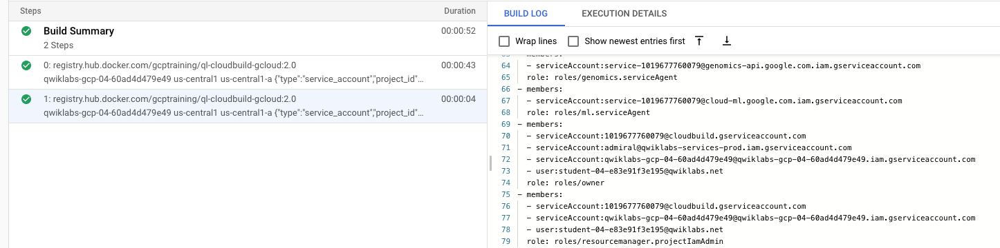

# Elevate Cloud Build or Deployment Manager privileges inside qwiklabs

Qwiklabs lab projects leave the service accounts at default settings.  Deployment Manager and Cloud Build are two services used to provision the project and they default to `roles/editor`.  This causes problems when you want to use DM or CB to provison the project on launch.

A workaround utilizes the service account that QL creates for the lab.  The QL service account (qlapi) has the roles set in the lab configuration.  When the lab is started the qlapi json keyfile is passed to the lab's DM configuration via a property.  The workaround takes that keyfile and uses it with a custom-crafted image to change the DM and/or CB privileges.

```jinja
resources:
- name: elevate-cb-permissions
  action: gcp-types/cloudbuild-v1:cloudbuild.projects.builds.create
  metadata:
    runtimePolicy:
    - UPDATE_ALWAYS
  properties:
    steps:
    - name: registry.hub.docker.com/gcptraining/ql-cloudbuild-gcloud:2.0
      args:
      - {{ env['project'] }}
      - {{ properties['region'] }}
      - {{ properties['zone'] }}
      - '{{ properties['keyFile'] }}'
      - projects
      - add-iam-policy-binding
      - {{ env['project'] }} 
      - --member 
      - serviceAccount:{{ env['project_number'] }}@cloudbuild.gserviceaccount.com
      - --role
      - roles/owner
    - name: registry.hub.docker.com/gcptraining/ql-cloudbuild-gcloud:2.0
      args:
      - {{ env['project'] }}
      - {{ properties['region'] }}
      - {{ properties['zone'] }}
      - '{{ properties['keyFile'] }}'
      - projects
      - add-iam-policy-binding
      - {{ env['project'] }} 
      - --member 
      - serviceAccount:{{ env['project_number'] }}@cloudbuild.gserviceaccount.com
      - --role
      - roles/resourcemanager.projectIamAdmin
    timeout: 120s
```

Once run, the Cloud Build output displays the results:



Make sure you:

1. Give your lab `roles/owner` and `roles/resourcemanager.projectIamAdmin`.
2. Ensure all actions requiring elevation use `dependsOn`.
